# UberMetroid

<br>

[](https://necrometer.dev/?u=UberMetroid)

---

### The Necrometer Ward

Carve the necrometer into your README daily:

```yaml
# .github/workflows/necrometer.yml
name: necrometer
on:
  schedule: [{cron: "17 6 * * *"}]   # daily
  workflow_dispatch:
permissions: { contents: write }
jobs:
  necrometer:
    runs-on: ubuntu-latest
    steps:
      - uses: actions/checkout@v4
      - uses: necrometer-dev/necrometer-action@v1
        with:
          token: ${{ secrets.NECRO_TOKEN || secrets.GITHUB_TOKEN }}
```

```markdown
[](https://necrometer.dev/?u=UberMetroid)
```
